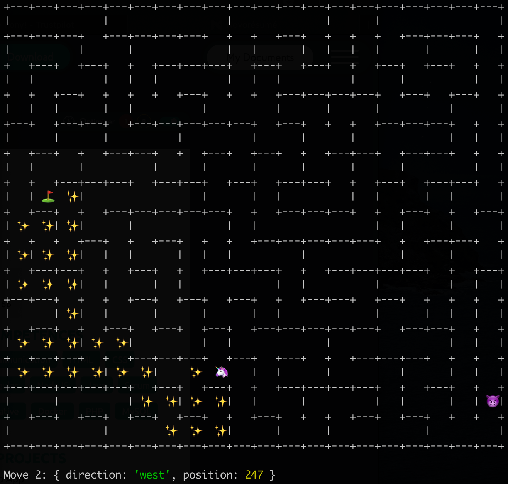

# Pony Challenge Solution ([repo](https://github.com/petr166/pony-challenge))

My solution for [the pony challenge](https://ponychallenge.trustpilot.com/index.html)

## What you need

- NodeJS with npm/yarn (built with node v14.9.0)

## How to run

```bash
# install npm dependencies
npm i;

# start game
npm start;
```

## Features

- game menu, with option to change settings (e.g. pony name, difficulty)
- full game run by pressing "Play"
- bot plays the game until it wins or dies trying
- displaying the maze "ui"
- displaying followed route
- displaying next move information
